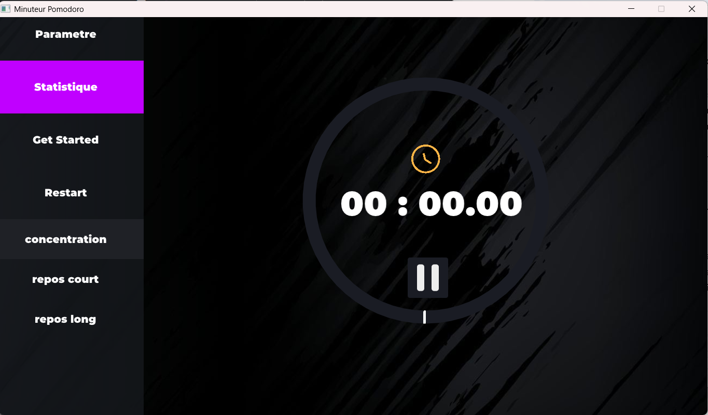
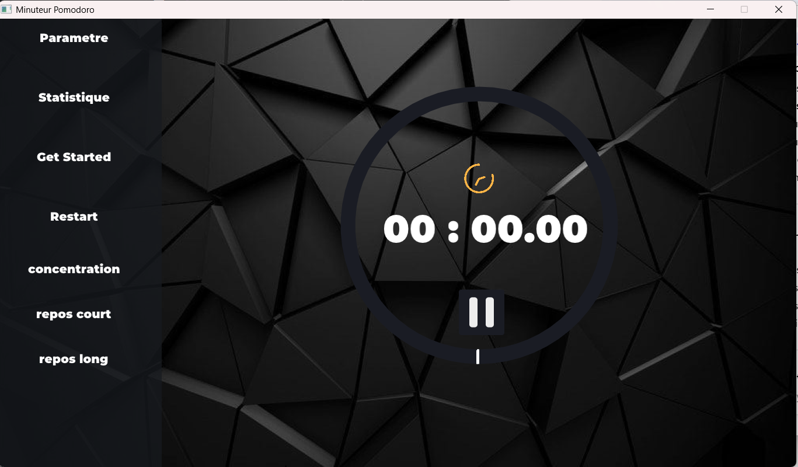
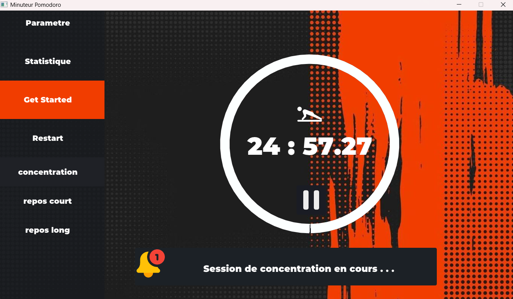
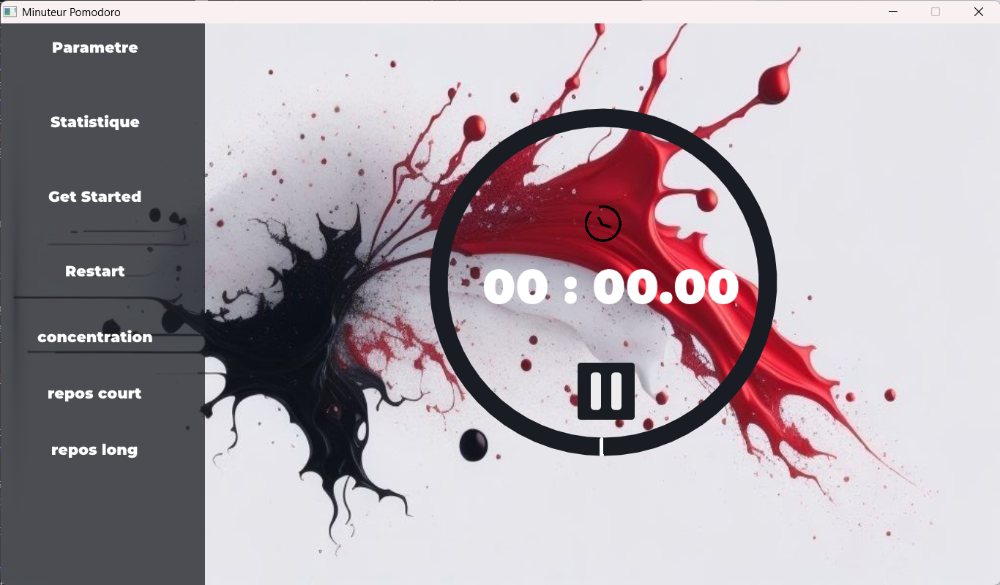
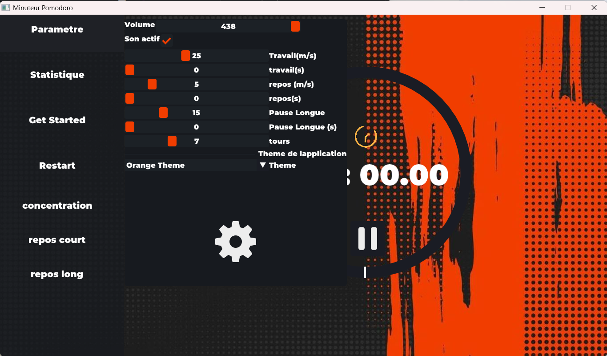
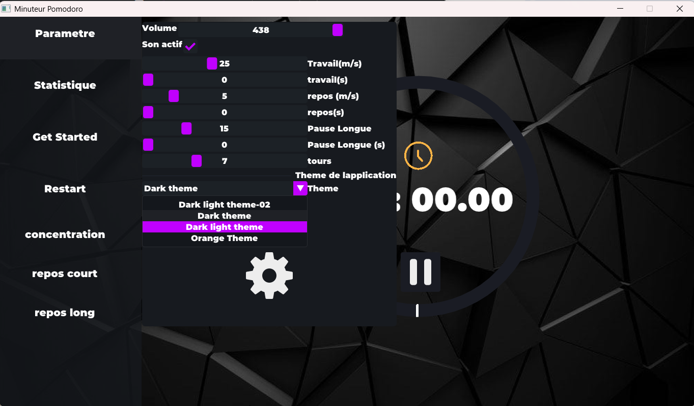
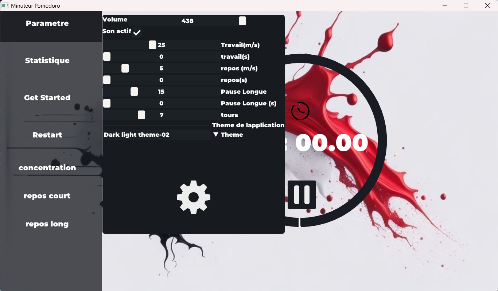
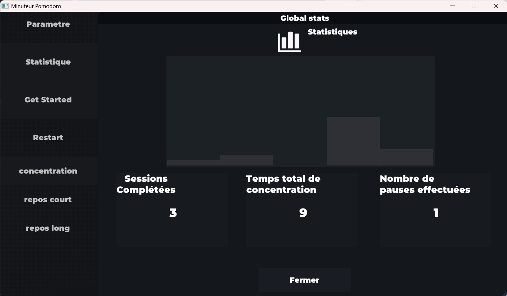

# 📚 **Projet 23:  Minuteur Pomodoro - Timer de productivité avec sessions, pauses. Statistiques**

## 👨‍🏫Description du projet

<div align = justify>

Le chronomètre pomodoro est un modèle particulier de chronomètre permettant à l'utilisateur de maintenir sa concentration. Il propose quatre sessions différentes : deux de concentration de 25 minutes et deux autre de pause dont une session plus longue. L’application affichera les statistiques (temps de concentration et temps de pause avec comparaison avec la session précédente). L’utilisateur sera en mesure de choisir la durée de chaque période (concentration ou pause) à sa convenance, personnaliser à sa convenance l'arrière-plan de l'application avec des images prédéfinies. Et enfin avoir un visuel sur l'évolution de son travail entre la session courante et les sessions précédentes.

</div>

## **structure du projet**
```
MINUTEUR-POMODORO/
├── assets/                     # Ressources de l'application
│   ├── backgrounds/            # Images d’arrière-plan
│   ├── exemples/               # Exemples et démos
│   ├── licence/                # Fichiers de licence des assets
│   ├── musique/                # Musiques et sons
│   ├── notification/           # Sons de notification
│   └── tools/                  # Outils liés aux assets
│
├── build/                      # Fichiers de build générés
│
├── include/                    # Fichiers d’en-tête (.h)
│
├── libs/                       # Bibliothèques externes
│
├── police/                     # Polices d’écriture
│
├── src/                        # Code source
│   ├── core_app/               # Logique principale de l’application
│   │   ├── AppCore.cpp
│   │   ├── pomodoro.cpp
│   │   ├── sound.cpp
│   │   └── statistic.cpp
│   │
│   ├── graphics/               # Rendu graphique et UI
│   │   ├── rendererStats.cpp
│   │   ├── renderUi.cpp
│   │   ├── window.cpp
│   │   └── windowUI.cpp
│   │
│   └── main.cpp                # Point d’entrée de l’application
│
├── .gitignore                  # Fichiers ignorés par Git
├── build.sh                    # Script de compilation
├── imgui.log.txt               # Log ImGui
├── imgui.ini                   # Configuration ImGui
├── LICENSE                     # Licence du projet
└── README.md                   # Documentation principale

```
## ⚙️**Fonctionnalités Principales**

## ⏱️ Gestion des sessions
Ce chronometre pomodoro se propose d'offrir à l'utilisateur un totql de 5 sessions pqr cycles; qlternqnt en 2 **sessions de concentration** qvec un temps par defaut de 30 minutes chacunesm **2 sessions de pauses courtes** et dùune session de **pause longue**.

## 🎨Personnalisation du temps de chaque sessiosn
allocation du temps variant entre 0 et 60 minutes ou secondes;
- **changement du theme principal de l'application** : cette fonctionnalité plus esthétique perment à l'utilisateur de se sentir plus à l'aise selon ses préférences esthétiques.
<p align="center">
  
  
  
  
</p>

## 📊 Statistiaues et suivi de progression
- Etat du nombre de sessions passées en tout:
- rendu sous forme d'un histogramme de lùevolution du parcours de l'utilisateur

## **Guide d'utilisation de l'Application**
- **Acces aux parametre** : bouton ```paramrtre```. ce bouton donne acces à l'interfqce de chqnge,ent de theme ; de definition de la durée des sessions et du choix de la presence ou non de son.
<p align="center">
    
    
    
</p>

- **Lancement et pause** : bouton ```pause``` en dessous du chronometre, ou encore ```GEt started``` le long de la barre de menu pour lancer le decompte de sessions
- **verifications manuelles des statistiques** : bouton ```statistique```. il affiche une fenetre au theme sombre avec histogramme et compteur de session etc...

<p align="center">
    
</p>

## comment compiler le projet
il suffit d'executer le script shell de buil présent dans le dossier parent
```
./build.sh
```
- execution:
```
./libs/pomodoro
```
## **cas d'usage**

lùutilisation et la prise en main de cette application peut être faite par n'importe quel étudiant souhaitant avoir une meilleure qualité de gestion du temps ou toute personne adepte de la méthode pomodoro pour la planificaton et l'organisation de son travail.

## Ce que j'ai appris de ce projet
De ce projet j'ai pu tirer beaucoup de choses constructives:
- une meilleure orgqnisqtion des projets
- des connaissances approfondies sur la bibliothèque grqphique ImGui mqis qussi SDL3 et SFML
- la redaction de scripts **shell** de compilation intelligents automatisant les tâches de compilation et tenant compte de l'ajout ou du retrait de modules du projet.